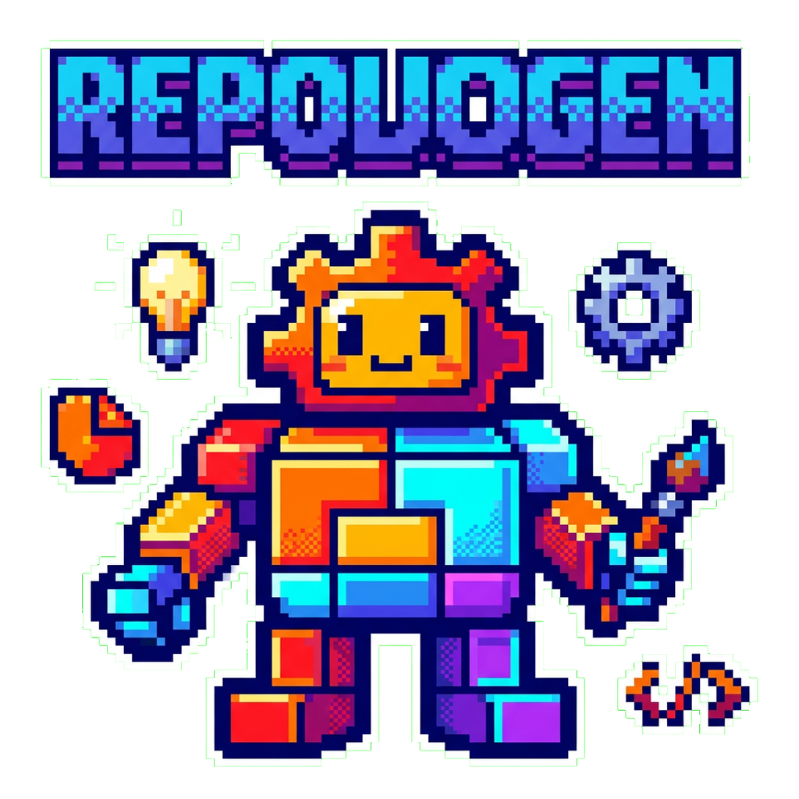

<div align="center">
  

  [](LICENSE)
  [](https://www.python.org)
  [](https://openrouter.ai)

  **🎨 Generate repo logos and core brand assets from the command line ✨**

  [Installation](#-installation) · [Quick Start](#-quick-start) · [Configuration](#%EF%B8%8F-configuration)
</div>

---

## Overview

[](https://github.com/tsilva/repologogen/actions/workflows/release.yml)

**The pain:** Every project needs a logo, but commissioning one takes time and money. Stock icons look generic. AI tools require manual transparency cleanup, awkward cropping, and repetitive prompt engineering.

**The solution:** repologogen auto-detects your project type, builds tailored prompts, generates a primary logo plus a dedicated icon mark via OpenRouter, and expands them into a core brand pack with icons, favicons, a social card, and manifest data.

**The result:** Production-ready repo branding in under 30 seconds, with zero manual post-processing.

## ⚡ Features

- **One-Command Generation** — Point at any repo and get a polished logo or full core brand pack
- **Automatic Transparency** — Chromakey-to-alpha conversion with graduated edge detection
- **Smart Trimming** — Crops excess padding and resizes to fill the canvas
- **Core Brand Bundle** — Generate logo, icon, favicon set, social card, and manifest JSON
- **Project Detection** — Recognizes Python, Node.js, Rust, Go, Java, .NET, Ruby, PHP, and C++ projects
- **3-Tier Config** — Project `.config.yaml` > User `~/.repologogen/config.yaml` > Built-in defaults
- **Custom Prompts** — Full template system with variables for style, colors, metaphors, and more
- **PNG Compression** — Optimized file size with configurable quality
- **Dry Run Mode** — Preview the generated prompt before spending API credits

## 📦 Installation

```bash
pip install repologogen
```

Or install from source:

```bash
git clone https://github.com/tsilva/repologogen.git
cd repologogen
pip install -e .
```

## 🚀 Quick Start

**1. Set your API key** (pick one):

```bash
# Option A: Environment variable
export OPENROUTER_API_KEY="your-key"

# Option B: User config (persists across projects)
mkdir -p ~/.repologogen
echo 'openrouter_api_key: your-key' > ~/.repologogen/config.yaml
```

**2. Generate:**

```bash
# Logo only
repologogen

# Full core brand pack
repologogen --bundle core-brand
```

**3. Done.** Your `logo.png` or `repologogen-assets/` bundle is ready.

## 🛠️ Usage

```bash
# Generate logo for current project
repologogen

# Generate the full core brand pack
repologogen --bundle core-brand

# Target a specific project
repologogen /path/to/project

# Custom style across generated assets
repologogen -s "pixel art"

# Custom output path
repologogen -o assets/logo.png

# Custom asset directory for the core brand bundle
repologogen --bundle core-brand --assets-dir branding

# Override project name
repologogen -n "My Project"

# Preview prompt without generating
repologogen --dry-run

# Verbose output
repologogen -v
```

### CLI Flags

| Flag | Description |
|------|-------------|
| `--bundle` | Select `logo` or `core-brand` generation mode |
| `-s`, `--style` | Override logo style |
| `-o`, `--output` | Override output path for the `logo` bundle |
| `--assets-dir` | Override output directory for bundle assets |
| `--manifest` | Override manifest path for bundle assets |
| `-n`, `--name` | Override project name |
| `-m`, `--model` | Override AI model |
| `-c`, `--config` | Path to custom config file |
| `--no-trim` | Skip transparent padding trim |
| `--no-compress` | Skip PNG compression |
| `--no-refine` | Skip prompt refinement |
| `--dry-run` | Show prompt without generating |
| `--var KEY=VALUE` | Set template variable (repeatable) |
| `-v`, `--verbose` | Enable verbose output |

## ⚙️ Configuration

Configuration loads in priority order — project overrides user, user overrides defaults:

```
.config.yaml (project) > ~/.repologogen/config.yaml (user) > built-in defaults
```

**Example `.config.yaml`:**

```yaml
model: google/gemini-3-pro-image-preview
size: 1K
bundle: core-brand
assets_dir: branding
style: "SNES 16-bit pixel art"
icon_colors:
  - "#58a6ff"
  - "#d29922"
  - "#a371f7"
key_color: "#00FF00"
tolerance: 70
output_path: logo.png
include_repo_name: true
trim: true
trim_margin: 5
compress: true
compress_quality: 80

assets:
  icon:
    style: "flat badge"
  social_card:
    enabled: true
```

### All Options

| Option | Default | Description |
|--------|---------|-------------|
| `model` | `google/gemini-3-pro-image-preview` | AI model for image generation |
| `size` | `1K` | Image size (`1K`, `2K`, etc.) |
| `style` | `minimalist` | Logo style descriptor |
| `visual_metaphor` | `null` | Custom visual metaphor (`null` = auto-detect, `none` = abstract) |
| `include_repo_name` | `false` | Include project name as text in logo |
| `icon_colors` | `["#58a6ff", ...]` | Color palette (array or string) |
| `key_color` | `#00FF00` | Chromakey background color |
| `tolerance` | `70` | Chromakey edge detection tolerance (0–255) |
| `output_path` | `logo.png` | Output file path (supports `{PROJECT_NAME}`) |
| `trim` | `true` | Trim transparent padding |
| `trim_margin` | `5` | Margin percentage around trimmed content (0–25) |
| `compress` | `true` | Enable PNG compression |
| `compress_quality` | `80` | Compression quality (1–100) |
| `additional_instructions` | `""` | Extra text appended to the AI prompt |
| `prompt_template` | `null` | Fully custom prompt template |
| `bundle` | `logo` | Default bundle to generate (`logo` or `core-brand`) |
| `assets_dir` | `repologogen-assets` | Output directory for bundle assets |
| `manifest_path` | `repologogen-assets/manifest.json` | Manifest path for the bundle output |

### Asset Override Config

Top-level creative settings remain the defaults for every generated asset. Use `assets.*` blocks only when a specific asset needs an override.

Supported override keys per asset:

- `enabled`
- `style`
- `visual_metaphor`
- `include_repo_name`
- `icon_colors`
- `additional_instructions`
- `model`
- `size`
- `prompt_template`

### Bundle Output

`repologogen --bundle core-brand` writes:

```text
repologogen-assets/
├── app-icons/
│   ├── android-chrome-192.png
│   ├── android-chrome-512.png
│   └── apple-touch-icon.png
├── favicon/
│   ├── favicon-16.png
│   ├── favicon-32.png
│   ├── favicon-48.png
│   └── favicon.ico
├── icon/
│   └── icon-512.png
├── logo/
│   └── logo-1024.png
├── social/
│   └── social-card-1200x630.png
└── manifest.json
```

The manifest includes asset paths plus reusable metadata fields:

- `title`
- `short_description`
- `social_title`
- `social_description`
- `keywords`

### Custom Prompt Templates

Override the default prompt with your own template using any of these variables:

```yaml
prompt_template: >-
  Create a {STYLE} icon for {PROJECT_NAME}.
  Use colors: {ICON_COLORS}. Background: {KEY_COLOR}.
  {TEXT_INSTRUCTIONS}
```

**Built-in variables:** `{PROJECT_NAME}`, `{STYLE}`, `{ICON_COLORS}`, `{KEY_COLOR}`, `{VISUAL_METAPHOR}`, `{TEXT_INSTRUCTIONS}`

Additional variables can be passed via `--var KEY=VALUE` on the CLI.

## 🔧 How It Works

```
cli.py → config.py → detector.py → planner.py → generator.py → processor.py
```

1. **Config Loading** — Merges bundled defaults, user config, and project config with JSON Schema validation
2. **Project Detection** — Matches file patterns (`pyproject.toml` → Python, `package.json` → Node.js, etc.)
3. **Planning** — Resolves the selected bundle, per-asset overrides, and output paths
4. **Image Generation** — Calls OpenRouter API (OpenAI-compatible) for a canonical transparent brand mark
5. **Processing** — Applies chromakey removal, trim, and compression to the generated logo and icon sources
6. **Derivation** — Exports deterministic favicon and app-icon sizes from the dedicated icon mark so they stay legible at very small sizes
7. **Composition** — Builds the social card locally and writes a manifest JSON with metadata and asset paths

### Supported Project Types

| File Pattern | Detected Type |
|-------------|---------------|
| `pyproject.toml`, `setup.py`, `Pipfile` | Python |
| `package.json` | Node.js |
| `Cargo.toml` | Rust |
| `go.mod` | Go |
| `pom.xml`, `build.gradle` | Java |
| `*.sln`, `*.csproj` | .NET |
| `Gemfile` | Ruby |
| `composer.json` | PHP |
| `CMakeLists.txt` | C++ |

## 🧑‍💻 Development

```bash
git clone https://github.com/tsilva/repologogen.git
cd repologogen
pip install -e ".[dev]"

# Run tests
pytest

# Lint & format
ruff check src/ tests/
ruff format src/ tests/

# Type checking
mypy src/repologogen/
```

## 📄 License

[MIT](LICENSE)

## 🔗 Related

This CLI is a standalone adaptation of the `project-logo-author` skill from [claudeskillz](https://github.com/tsilva/claudeskillz).
