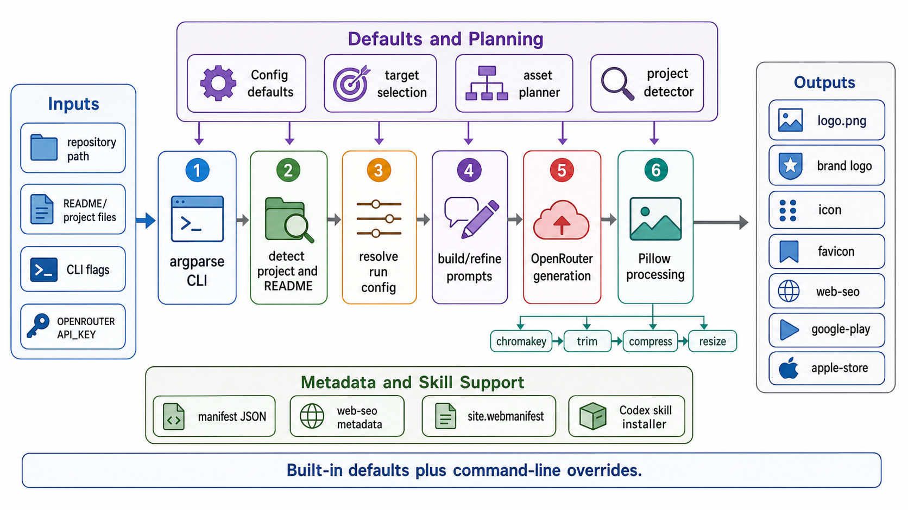

<div align="center">
  

  **🎨 Generate repo logos, brand packs, and platform assets from the command line ✨**
</div>

repologogen is a Python CLI for generating repository logos and brand asset packs through
OpenRouter image models. Point it at a project, and it detects the project type, builds a
prompt, generates a logo, removes the chromakey background, trims padding, and compresses
the PNG output.

It can also generate a core brand pack with icon, favicon, web SEO, Google Play, and Apple
App Store assets from the main logo.

## Install

```bash
pip install repologogen
export OPENROUTER_API_KEY="your-key"
repologogen
```

Or install from source:

```bash
git clone https://github.com/tsilva/repologogen.git
cd repologogen
pip install -e ".[dev]"
repologogen --dry-run
```

The default command writes `logo.png` in the current project.

## Use

```bash
repologogen
repologogen /path/to/project
repologogen --web
repologogen --target web-seo --target google-play --target apple-store
repologogen -s "pixel art" -n "My Project"
repologogen --dry-run
```

## Commands

```bash
repologogen                         # generate logo.png for the current project
repologogen --web                   # write Next.js-ready web assets to public/brand
repologogen --target web-seo        # generate a core brand pack with web SEO assets
repologogen --target google-play    # include Google Play icon and feature graphic
repologogen --target apple-store    # include Apple App Store icon
repologogen -o assets/logo.png      # override the logo output path
repologogen --assets-dir branding   # override brand pack output directory
repologogen --var KEY=VALUE         # pass custom prompt-template variables
repologogen --no-trim               # skip transparent padding trim
repologogen --no-compress           # skip PNG compression
pytest                              # run tests
ruff check src/ tests/              # lint
mypy src/repologogen/               # type check
```

## Notes

- Requires Python 3.10+.
- The OpenRouter API key is read from `OPENROUTER_API_KEY`, then
  `~/.config/repologogen/.env`.
- Runtime configuration is built-in defaults plus command-line overrides.
- `--web` implies `core-brand`, adds the `web-seo` target, and writes assets to
  `public/brand`.
- Brand packs write a manifest to `<assets-dir>/manifest.json` unless `--manifest`
  overrides it.
- The repo-owned Codex skill lives in `skills/repologogen/`; refresh it with
  `python3 scripts/install_codex_skill.py` or `make install-skill`.

## Architecture



## License

[MIT](LICENSE)
